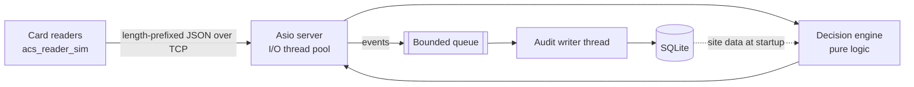

# AccessControl Sim

A C++20 simulation of a physical access control system. Simulated card readers
send badge swipes over TCP to a controller. The controller checks each swipe
against cardholders, access groups, zones and weekly schedules. It answers
**grant** or **deny** with a reason, records every event in a SQLite audit log,
and flags readers that stop sending heartbeats.



## Highlights

- **Pure decision engine.** `decide(request, snapshot, now)` does no I/O,
  locking or clock reads, so every deny reason and schedule edge case is a
  plain unit test.
- **Deny by default.** Unknown cards, malformed messages and internal errors
  all deny, each with a reason code.
- **The network never waits for the disk.** Audit events pass through a
  bounded, non-blocking queue to a writer thread that commits in batches.
- **Robust connections.** Heartbeat monitoring raises `ReaderOffline` and
  `ReaderOnline` events. Idle or half-open connections are closed so they
  can't leak sockets.
- **Operational basics.** Validated JSON config, logfmt-style logs, and
  graceful SIGINT/SIGTERM shutdown that flushes the audit queue.
- **Tested.** 163 unit and integration tests, run in CI under ASan, UBSan and
  TSan, including a 32-reader concurrency test against a real server.
- **Fast.** About 150k decisions/s end to end on a laptop
  ([benchmark](docs/benchmark.md)).

## Quick start

Requires a C++20 compiler (GCC 12+, Clang 15+, MSVC 2022), CMake 3.24+ and the
SQLite 3 headers (`libsqlite3-dev` on Debian/Ubuntu; bundled with macOS).
CMake fetches the other dependencies.

```bash
cmake -S . -B build -DCMAKE_BUILD_TYPE=Debug && cmake --build build -j
ctest --test-dir build --output-on-failure

# Server with the sample site (creates acs.db); Ctrl-C flushes the audit log and exits
./build/bin/acs_server --config config/server.json --seed config/seed.json

# In another terminal: 10 virtual readers, 100 swipes each
./build/bin/acs_reader_sim --host 127.0.0.1 --port 5050 --readers 10

sqlite3 acs.db "SELECT decision, reason, COUNT(*) FROM access_events GROUP BY 1, 2;"
```

For sanitizer builds, add `-DACS_ENABLE_SANITIZERS=ON` (ASan + UBSan) or
`-DACS_ENABLE_TSAN=ON` to the configure step, in a separate build directory.

## Wire protocol

A 4-byte big-endian length, then a UTF-8 JSON payload (64 KiB max). Full spec:
[docs/protocol.md](docs/protocol.md).

```json
{ "type": "access_request", "reader_id": "R-101", "card": "10001", "facility": 42, "seq": 17 }
{ "type": "access_response", "seq": 17, "decision": "deny", "reason": "OutsideSchedule" }
{ "type": "heartbeat", "reader_id": "R-101" }
```

## Layout

```
src/core     Domain model          src/net      Framing, codec, Asio server, sessions
src/engine   Decision engine       src/server   acs_server: config, logging, wiring
src/events   Queue, audit writer   src/sim      acs_reader_sim and VirtualReader
src/storage  SQLite repositories   tests/       Unit (mirrors src/) and integration
```

## Docs

- [Architecture](docs/architecture.md): components, threads, startup and shutdown
- [Design decisions](docs/decisions.md): 12 ADRs, each listing the alternatives rejected
- [Wire protocol](docs/protocol.md)
- [Benchmark](docs/benchmark.md)

## Known limitations

- Schedules are evaluated in UTC; a site time zone needs a DST policy (ADR-003).
- Site data changes need a restart; hot reload would be an atomic snapshot swap (ADR-001).
- No TLS or authentication on the reader protocol (stretch goal).
