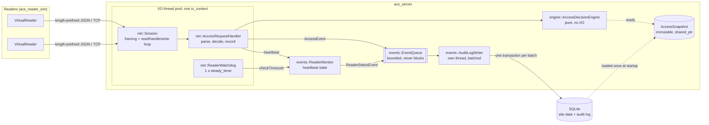

# Architecture

## Components and data flow



Data flows one way. A request comes in, gets a decision, and the reply goes
back on the same connection. Every decision and reader status change also
flows forward into the audit log. Nothing on the request path waits for the
database.

## Libraries and dependencies

Each `src/` directory is one static library and one namespace. Dependencies
only point downward:

```
acs_server (main)      acs_reader_sim (main)
   │                        │
   ├── acs_server_lib       └── acs_sim ──┐
   ├── acs_storage ──┐                    │
   └── acs_net ──────┼────────────────────┘
                     ▼
                 acs_events
                     ▼
                 acs_engine
                     ▼
                  acs_core
```

- `core` and `engine` have no third-party dependencies at all.
- `events` defines the `IEventRepository` interface. `storage` implements it,
  so the event pipeline never depends on SQLite (ADR-006).

## Threads and ownership

| Thread | Runs | Owns / touches | Synchronisation |
|---|---|---|---|
| main | startup, then `io.run()` like the others; shutdown | config, both `Database` connections during startup | n/a |
| I/O pool (N) | `Session` handlers and idle timers, `ReaderWatchdog` timer, signal handler | each `Session`'s socket, timer and buffers | one pending I/O op per session (ADR-004); socket and idle timer share the session's strand (ADR-012); snapshot is immutable |
| audit writer | `AuditLogWriter::run` | the audit `Database` connection | `EventQueue` mutex + condition variable |

Shared mutable state, and what protects it:

| State | Written by | Read by | Protection |
|---|---|---|---|
| `EventQueue` | I/O threads | writer thread | `std::mutex` + `std::condition_variable` |
| `ReaderMonitor` | I/O threads (heartbeats), watchdog | same | `std::mutex`, held while queueing its event (ADR-011) |
| `AccessSnapshot` | nobody after startup | all I/O threads | immutable (`shared_ptr<const>`) |
| drop / failure counters | I/O threads / writer | shutdown log | inside queue lock / `std::atomic` |

**Lock order.** There is exactly one nested acquisition: `ReaderMonitor`'s
mutex, then `EventQueue`'s. It makes each reader status change and its audit
event one atomic step (ADR-011). The queue's lock is a leaf: nothing is called
and no other lock is taken while it is held. So the order is fixed, and the
code cannot deadlock. Every other lock is taken alone.

## Startup

1. Parse `--config` (unknown keys and bad values are fatal) and set up logging.
2. Open the database and create any missing tables.
3. If `--seed` is given, replace all site data in one transaction.
4. Load the `AccessSnapshot`.
5. Open a second connection for the audit writer and start its thread.
6. Create the `ReaderMonitor`, which starts watching every configured reader now.
7. Bind the port, start accepting, start the watchdog, and install the
   SIGINT/SIGTERM handler.
8. Run the io_context on N threads.

Any failure before step 8 is exceptional. The process prints one line to
stderr and exits with code 1.

## Shutdown (SIGINT / SIGTERM)

1. The signal handler calls `io.stop()`, and every I/O thread returns.
2. Join the I/O threads. Nothing else can be queued now.
3. `AuditLogWriter::stop()` writes out everything still queued, then joins.
4. Log the drop and failure totals, and exit 0.

Events that were already queued are never lost. A reply still in flight can
be, but a reader with no reply denies by default (ADR-010).

## Design records

The reasons behind each decision are in [decisions.md](decisions.md), the
wire format in [protocol.md](protocol.md), and performance in
[benchmark.md](benchmark.md).
